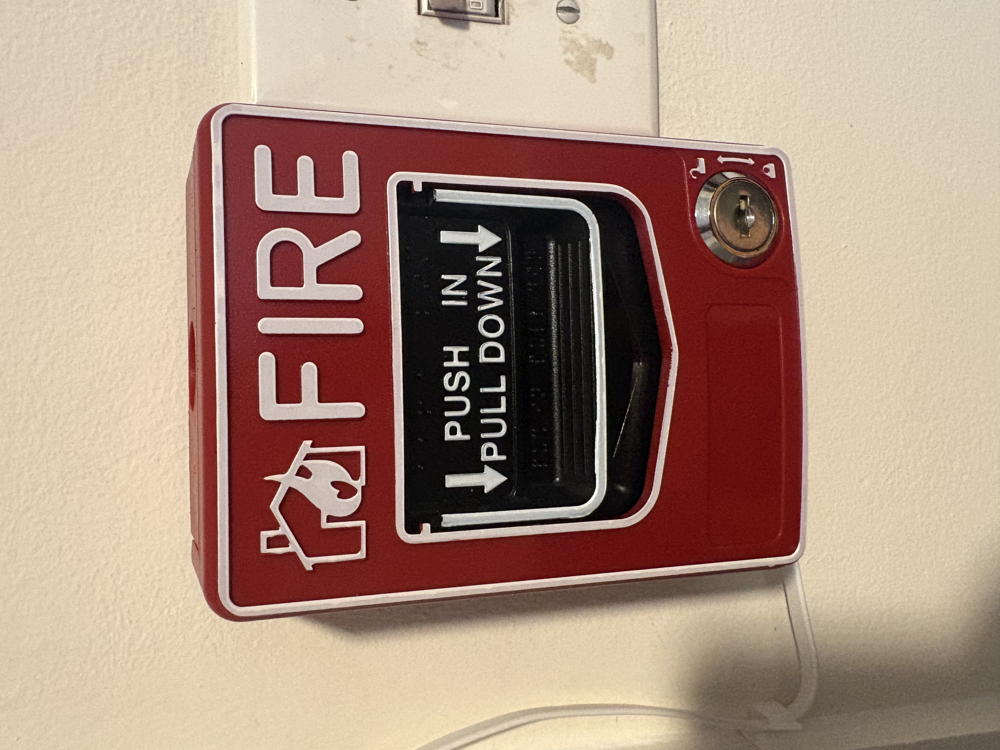
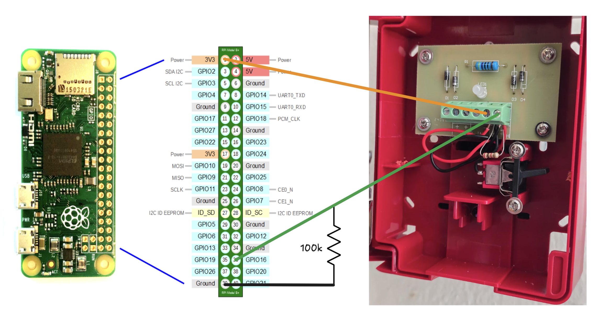

# Fire Alarm MQTT Node

This project turns a physical button (like a repurposed fire alarm pull-station) into an MQTT-enabled smart home trigger for Home Assistant. 

It is built to run as a headless appliance on a Raspberry Pi Zero W, prioritizing instant response times and system stability so it behaves like a real hardware switch.

## Hardware Setup

 
*Caption: Brief description of the physical switch.*

### Wiring Diagram

*Caption: GPIO 16 wired to the switch, pulling to ground.*

## Key Features
* **One-script setup:** No manual Linux configuration required. A single `setup.sh` script handles everything from Python virtual environments to systemd services and hardware drop-ins, making installation completely plug-and-play.
* **Zero lag & reliable connection:** Built for absolute zero-latency. OS-level tweaks keep the Wi-Fi permanently awake, while a persistent background MQTT socket guarantees instant reaction times. If the system ever hangs, a native hardware watchdog automatically forces a physical reboot.
* **Ultra-Low Overhead:** Instead of wastefully polling the GPIO pins, the script uses hardware interrupts. The CPU idles at 0.0%, running cool and drawing minimal power.
* **Configured in Home Assistant:** The hardware simply announces when it is pressed. All the rules for what happens next are handled in Home Assistant, meaning the switch's actions can be easily changed directly from the app without editing any Python code.
* **Smart Multi-Action:** Natively distinguishes between short taps and long holds. Built-in state tracking gracefully intercepts the physical release of the button, guaranteeing that a long-press never accidentally triggers a short-press payload on its way up.
* **Fail-Safe Dashboards:** Utilizes MQTT's Last Will and Testament (LWT) protocol. If the hardware unexpectedly loses power, the broker instantly tells Home Assistant to mark the device as "Offline," keeping dashboards perfectly synced with physical reality instead of displaying a ghost switch.

## Installation

**1. Clone the repository**
```bash
git clone [https://github.com/vishalmshah/firealarm-lightswitch-HA.git](https://github.com/vishalmshah/firealarm-lightswitch-HA.git)
cd firealarm-lightswitch-HA
```

**2. Configure your credentials**
Create your local configuration file from the provided template. (Git will automatically ignore your real config file to keep passwords safe).
```bash
cp src/config.example.py src/config.py
vim src/config.py
```

**3. Run the automated setup**
Execute the deployment script. This creates a Python virtual environment, applies the OS drop-in configs, and starts the systemd service.
```bash
sudo bash setup.sh
```

## Home Assistant Integration

This node acts as a dumb sensor. It broadcasts state changes, allowing you to map those changes to actions entirely within the Home Assistant UI.

### MQTT Payloads
The node publishes to `home/fire_alarm/action`.
* `SHORT_PRESS`: Fired when the button is pressed and released quickly.
* `LONG_PRESS`: Fired when the button is held past the threshold (default 1.5s).

**Example HA Automations:**

*Short Press*
1. **Trigger:** MQTT, Topic: `home/fire_alarm/action`, Payload: `SHORT_PRESS`
2. **Action:** Toggle smart lights.

*Long Press*
1. **Trigger:** MQTT, Topic: `home/fire_alarm/action`, Payload: `LONG_PRESS`
2. **Action:** Turn on home stereo and dim lights.

## Project Structure

```text
firealarm-lightswitch-HA/
├── setup.sh                 # Infrastructure deployment runner
├── requirements.txt         # Python dependencies
├── src/                     # Core Python logic
│   ├── main.py              # MQTT client and GPIO logic
│   ├── config.py            # Local credentials (ignored by git)
│   └── config.example.py    # Template for credentials
└── system/                  # Linux configuration blueprints
    ├── firealarm.service.template
    ├── usercfg.txt
    ├── watchdog.conf
    └── wifi_powersave.conf
```

## Maintenance

Because the node runs natively via `systemd`, you can manage it with standard Linux commands:

```bash
sudo systemctl status firealarm   # Check service status
sudo journalctl -u firealarm -f   # View live streaming logs
sudo systemctl restart firealarm  # Restart the service manually
```